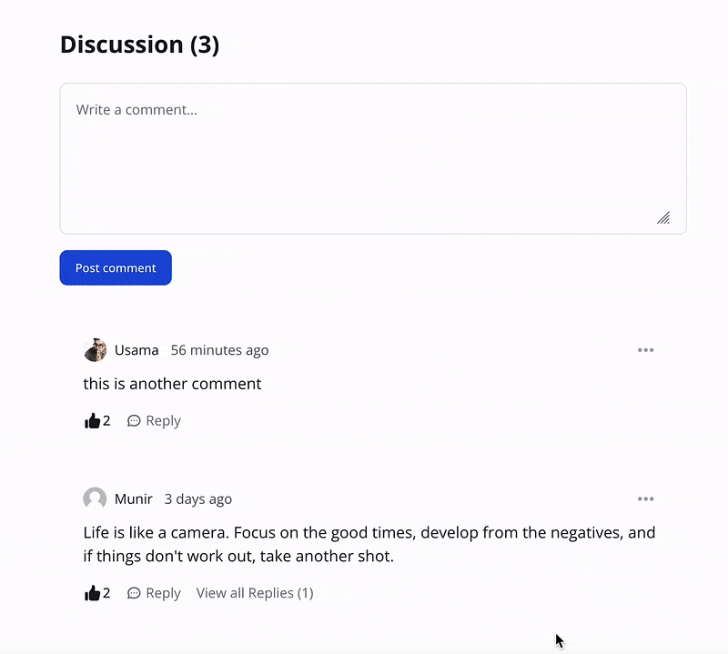

## Wirecomments - Laravel Livewire Comments

[](https://packagist.org/packages/innoboxrr/wirecomments)
[](https://scrutinizer-ci.com/g/innoboxrr/wirecomments/?branch=main)
[](https://www.codefactor.io/repository/github/innoboxrr/wirecomments)
[](https://scrutinizer-ci.com/g/innoboxrr/wirecomments/build-status/main)
[](https://scrutinizer-ci.com/code-intelligence)
[](https://packagist.org/packages/innoboxrr/wirecomments)
[](https://github.com/innoboxrr/wirecomments/blob/HEAD/LICENSE.md)



## Introduction

Wirecomments is a powerful Laravel Livewire package designed to provide an easy-to-integrate commenting system for any
model in your Laravel application. Powered by Livewire, this package offers a seamless commenting experience that is
powered by Tailwind UI, making it easy for users to engage with your content. With features like comments pagination
and YouTube-style like/unlike buttons, this package is perfect for applications that require robust commenting
capabilities. Additionally, guest users can like and unlike comments based on their IP addresses. Mentions can be
used with "@" to tag specific users in replies and edits, while Markdown support allows for rich formatting in
comments. Whether you're building a blog, an e-commerce platform, or any other type of web application, Wirecomments is a
powerful tool for enhancing user engagement and collaboration.

## Some Features Highlight

- Easy to integrate
- Supports Laravel 10+
- Supports Livewire 3
- Livewire powered commenting system
- Tailwind UI
- Add comments to any model
- Nested Comments
- Comments Pagination
- Youtube style Like/unlike feature
- Guest like/unlike of comments (based on `IP` & `UserAgent`)
- Mention User with @ in Replies/Edits
- Markdown Support

## Prerequisites

- [Livewire](https://laravel-livewire.com/docs/2.x/installation)
- [TailwindCSS](https://tailwindcss.com/)
- [AlpineJS](https://alpinejs.dev/essentials/installation)

## Installation Guide

You can install the package via composer:

```composer require innoboxrr/wirecomments```

### Register Service Provider

Add the service provider in `config/app.php`:

```php
Innoboxrr\Wirecomments\Providers\WirecommentsServiceProvider::class,
```

### Run Migrations

Once the package is installed, you can run migrations,
```php artisan migrate```

### Publish Config File

```php
 php artisan vendor:publish --tag="wirecomments-config"
```
This will publish `wirecomments.php` file in config directory. Here you can configure user route and pagination count etc.

### Publish `tailwind.config.js` file, 

This package utilizes TailwindCSS, and use some custom configurations. You can publish package's `tailwind.config.
js` file by running the following command:

```php
php artisan vendor:publish --tag="wirecomments-tailwind-config"
```

## Usage
In your model, where you want to integrate comments, simply add the `Commentable` trait in that model.
For example: 
```php
use Innoboxrr\Wirecomments\Traits\Commentable;

class Article extends Model
{
    use Commentable;
}
```

Next, in your view, pass in the livewire comment component. For example, if your view file is `articles/show.blade.
php`. We can add the following code:
```html
<livewire:comments :model="$article"/>
```

#### Additionally, add the `HasUserAvatar` trait in `App\Models\User`, to use avatars:
```php
use Innoboxrr\Wirecomments\Traits\HasUserAvatar;

class User extends Model
{
    use HasUserAvatar;
}
```

## Tests

`composer test`

## Security

If you discover any security related issues, please email hello@usamamuneer.me instead of using the issue tracker.

## Credits

- [Laravel](https://laravel.com)
- [Tailwind](https://tailwindcss.com/)
- [Livewire](https://laravel-livewire.com/)
- [FlowBite](https://flowbite.com)
- [All Contributors](https://github.com/innoboxrr/wirecomments/graphs/contributors)

## License

The MIT License (MIT). Please see [License File](LICENSE.md) for more information.


